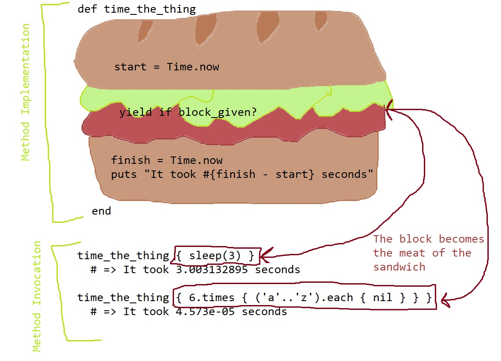

# Blocks

- [Closures](#closures)
- [What are blocks?](#what-are-blocks?)
- [Writing methods that take blocks](#writing-methods-that-take-blocks)
  - [Passing Execution to a Block](#passing-execution-to-a-block)
  - [Yielding with an Argument](#yielding-with-an-argument)
  - [Return Value of a Block](#return-value-of-a-block)

## Closures

A **closure** is an abstract programming concept that exists across multiple languages. It refers to a "chunk of code" that can be saved, somehow, and executed at a later time, possibly from a different location. Closures work by **binding** their _surrounding artifacts_, which can include variables, methods, objects, or other pieces of data and code.

This **binding** creates an _enclosure_ around all the artifacts so that they can be referenced at such a time as the closure is executed. That means that closures can use and even update local variables that are in scope for them when they are executed, _even if the call for execution comes from a place in the code where these variables are not in scope_.


Above, you can see how a closure (in this case, a block) binds surrounding local variables and references them during execution. The block itself begins with the `do` keyword and contains all the code up until the `end` keyword. Note that within our block implementation, we have access to the local variable `results`, which was initialized on line 6 to the value `['']`. This is because blocks have access to variables initialized in outer scope. The closure created by the block can retain a memory of this variable and its value via a binding.

When we invoke this block from within the `for_each_in` method with the `yield` statement on line 2, we can still access the local variable `results`, even though it is never passed into the method. This works because the block passed to `for_each_in` represents a closure, and binds the local variable `results` to itself.

The code within the block mutates this array, adding the value referenced by `total` as a new element for each iteration through the block. Therefore, when we output the `results` array on line 13, we will see the updated value `["", "a", "ab", "abc", "abcd", "abcde"]`.

In Ruby, **blocks**, **Procs**, and **lambdas** are all ways to implement a closure. Note that a `Proc` is an actual object instantiated from the `Proc` class, a lambda is really a special kind of these `Proc` objects, and a block _is not an object_.

A block isn't an object, so it isn't a value that we can return. However, a `Proc` _is_ an object, it's an instance of the `Proc` class. It's also a closure. That means we can actually assign closures to variables and pass them around. It also means that we can return them from either a method or a block.


Above, we define the method `alphabet` such that it returns a `Proc` object. This `Proc` forms a closure with local variables `counter` and `alphabet`. We invoke this method on line 14 and assign the returned `Proc` to the local variable `alpha1`. Now that the `Proc` is captured by a variable, we can invoke it whenever we want with the `Proc#call` method.

When we execute the `Proc`, it has its own private copy of `counter` and `alphabet`. The copy of `counter` gets incremented, but only for this particular `Proc` object. This is evident by the fact that we progress through the letters of the alphabet with each time we invoke the `Proc`.

We also have the capability to invoke `alphabet` again and return a new `Proc` object. When we call `alphabet` and assign the return value to `alpha2` on line 24, it represents a second instance of `Proc` that has its own separate copy of local variables `counter` and `letters`. Therefore, when we invoke `Proc#call` on it, we begin again with the letter `'a'`, because `counter` references `0`. In `alpha1`, on the other hand, we will get `'d'` by invoking the `Proc`, because in that case `counter` points to `3`.

## What are Blocks?

In Ruby, **blocks** are sections of code that are surrounded by `do...end` or `{ .. }`. They are passed as arguments to a method call. Any method can accept an implicit block, but only those that implement their execution with some sort of call to `yield` will execute the code inside the given block. How the method which takes the block is implemented determines how the return value of the block is used, if at all.

```ruby
# each executes a given block, but ignores its return value
['a', 'b', 'c'].each { |letter| puts letter.upcase }
# outputs: A B C each on a new line
# => ['a', 'b', 'c']

# times executes a given block, but ignores its return value
3.times { |i| i += 5 }
# => 3

# upcase can take a block, but it will not execute it
letter = 'a'
letter.upcase { puts letter }
# no output, the block is not executed
# => 'A'

# map executes a given block, uses the return value for transformation
['a', 'b', 'c'].map { |letter| letter.upcase }
# => ['A', 'B', 'C']

# select executes a given block, uses the return value for selection
['a', 'B', 'c'].select { |letter| letter =~ /[a-z]/ }
# => ['a', 'c']
```

Documentation tells us which methods can utilize a block, and how that block is used by the method.

## Writing Methods that take Blocks

To define a method that takes a block, utilize the keyword `yield`. This will execute any block that gets passed to the method in question as an argument. Ostensibly, it allows any other person, whether another developer or yourself in the future, to "inject" a section of code into the method that you have defined.

```ruby
def execute_block
  puts "Oh, did someone pass me a block?"
  yield
  puts "Cool! Well done!"
end

execute_block { puts "Yes sir, and here I am!" }

# => "Oh, did someone pass me a block?"
# => "Yes sir, and here I am!"
# => "Cool! Well done!"
```

If a method is implemented with a `yield` statement, but is passed no block, it will result in a `LocalJumpError`

```ruby
def execute_block
  puts "Oh, did someone pass me a block?"
  yield
  puts "Cool! Well done!"
end

execute_block
# raises: LocalJumpError (no block given (yield))
```

Make your `yield` statements more flexible by including them in a conditional that utilizes the `Kernel#block_given?` method. This will return `true` if a block is passed to the method in question and `false` if not.

```ruby
def execute_block
  puts "Oh, did someone pass me a block?"
  yield if block_given?
  puts "Cool! Well done!"
end

execute_block { puts "Yes and here I am!" }
# Oh, did someone pass me a block?
# Yes and here I am!
# Cool! Well done!

execute_block
# Oh, did someone pass me a block?
# Cool! Well done!
```

### Passing Execution to a Block

`yield` works by **passing execution to the block**. That is, it actually causes execution to move to where the block is defined (the closure) and execute the code within. Then, it will move back to where execution was before, and complete execution of the method to which we passed the block.

This implies a distinction between _method implementation_ and _method invocation_. Method implementation is where we define the method. This is where execution jumps to when we call a method to begin with. Method invocation is where we call the method. If we are working with a method that takes a block, passing the block happens during method invocation, not implementation. The block in question allows us to **refine the method implementation in a flexible way** without actually changing the other implementation steps of the original method we're calling.

For example:

```ruby
def town_crier(words)
  yield if block_given?
  puts "*** Here ye! Here ye! ***"
  puts "*** #{words} ***"
end

town_crier("Welcome to town!") { system 'clear' }
# clears the screen
# *** Here ye! Here ye! ***
# *** Welcome to town! ***

town_crier("The King Approaches!") { puts "Make way, ye peasants!" }
# Make way, ye peasants!
# *** Here ye! Here ye! ***
# *** The King Approaches! ***
```

In the above examples, the execution begins at the first _method invocation_ when we call `town_crier` with the string argument `"Welcome to town!"` and a block. Then, execution goes to _method implementation_, or where we have defined the `town_crier` method. `"Welcome to town!"` is assigned to the parameter `words`.

The next line yields to the given block. This means that execution jumps back to _method invocatin_ to find the closure represented by the block. In this case, it includes the statement `system 'clear'`. This is executed, and the screen is cleared.

Now that the block has been executed, execution goes back to the _method implementation_ and proceeds with the rest of the method. It will first output the string `"*** Here ye! Here ye! ***"` and then the string `"*** Welcome to town! ***"`.

The next time we call `town_crier` we pass different code in the block, so the method behaves slightly differently, without actually altering it's previously written implementation steps. Like before, execution begins at _method invocation_ when we call `town_crier` and pass the arguments `"The King Approaches!"` and a block. Execution then jumps to _method implementation_, and the string `"The King Approaches!"` is assigned to the parameter `words`.

Next, the method yields to the block, and execution again jumps back to _method invocation_. The block consists of the string `"Make way, ye peasants!"` passed to `puts`, so this string is output, and the block returns `nil`. Execution jumps back to _method implementation_. `town_crier` ignores the return value of the block, and proceeds to the next line. Again the strings `"*** Here ye! Here ye! ***"` and `"*** The King Approaches! ***"` are output to the screen.

Finally, the `town_crier` method returns `nil` and execution is done.

### Yielding with an Argument

It may be the case that the block we wish to pass into the method requires some kind of argument. We can make this happen with two additional steps, one at _method implementation_ and one at _method invocation_:

1. _Method Implementation_: Adding an argument to the `yield` statement, i.e. `yield(argument_to_pass)`
2. _Method Invocation_: Defining the block with a **block parameter**, i.e. `{ |block_parameter| # code goes here }`

Note: The block parameter is also known as a **block local variable**. This is a special type of local variable, whose scope is constrained to the block. It is imperative that we ensure the block parameter has a unique name and does not conflict with other local variables outside the block. This will result in _variable shadowing_.

When might we want to utilize a block that takes an argument? If we want to allow _users_ (the person invoking the method) to take some action on a value that exists within the method, and we aren't sure what that action might be. Blocks allow us the flexibility to define this action later, at invocation time.

The `each` method is an excellent example of this. `each` gets passed some kind of collection. The method iterates over the collection, and yields each element in turn to the block that gets passed to it. This is because we know the user wants to do _something_ to the collection's elements, but we're not sure what yet. They may want to output them, log them into a file, or mutate them in some way. Allowing the user to define this action with a block during invocation gives us this flexibility. Each element, in it's turn, represents the argument we pass into the block and assign to the block parameter.

```ruby
def for_each_in(array)
  counter = 0
  while counter < array.size
    yield(array[counter]) if block_given?
    counter += 1
  end
  array
end

for_each_in([1, 2, 3, 4]) { |num| puts num }
# 1
# 2
# 3
# 4

hello = ['g', 'd', 'k', 'k', 'n']
for_each_in(hello) { |letter| puts letter.next }
# h
# e
# l
# l
# o
```

Above, we have defined a method `for_each_in` which takes an array argument. It iterates through the elements of the array, yielding each in its turn to the block, if given. It then returns the original array.

We first call `for_each_in` and pass it the array `[1, 2, 3, 4]` as argument. The block represents the action we want to take on each element in the array. In this case, we define the block with block parameter `num`, to which the current element will be assigned for each iteration of the block. Then we output `num` using `puts`.

Code execution proceeds like this:

- First we invoke `for_each_in` and pass it the array `[1, 2, 3, 4]`.
- Execution jumps to method implementation. `[1, 2, 3, 4]` gets assigned to the parameter `array`.
- Local variable `counter` is initialized to `0`.
- We enter a `while` loop that executes until `counter < array.size` evaluates to `false`
- The current element of the array `array[counter]` (which references `1`) is yielded to the given block.
- Execution jumps back to method invocation. `1` is assigned to the block parameter `num`.
- The block is executed and `num` is output. The block returns `nil`.
- Execution jumps back to method implementation. `for_each_in` ignores the return value of the block.
- `counter` is incremented by `1`
- The process repeats until we iterate through the entire array
- `for_each_in` returns the original array

Next we call `for_each_in` on a different collection. This time we pass in the array referenced by local variable `hello` (or `['g', 'd', 'k', 'k', 'n']`). The flexibility of our method, because it yields to a block, allows us to perform an entirely different set of actions on an entirely different datatype, without actually changing the implementation of `for_each_in` at all.

Here, we are dealing with strings. Just as before, each string is yielded to the block in it's turn, where it is assigned to the block parameter `letter`. In this case, we have defined the block to output the value returned by `letter.next`. This results in `'h'`, `'e'`, `'l'`, `'l'`, `'o'` being output in turn.

**Note**: Unlike methods, if you pass the wrong number of arguments to a block, it will not throw an error. This is known as **lenient arity**. For more information on this see [arity](link-goes-here). *needs link

### Return Value of a Block

Like methods, blocks have a return value and this is determined by the last expression in the block. Whatever that expression evaluates to will be implicitly returned by the block. This value can be captures and utilized when execution returns to the method implementation that yielded to the block.

We can capture the return value of a block by assigning it to a local variable inside the method. This value, then, can be called up at any time and evaluated or manipulated.

```ruby
def before_and_after(obj)
  puts "Before: #{obj}"
  after = yield(obj)      # capture the return value of the block
  puts "After: #{after}"
end

before_and_after(0) { |num| num + 5 }
# Before: 0
# After: 5

before_and_after('good morning') { |greeting| greeting + "!!" }
# Before: good morning
# After: good morning!!
```

We can also utilize return values in other statements, such as conditionals. For example, the `Array#select` method uses the return value of a block and evaluates it for truthiness.

```ruby
def select_elements(array)
  results = []
  counter = 0
  while counter < array.size
    current_element = array[counter]
    # evaluate the return value of the block for truthiness
    results << current_element if yield(current_element)
    counter += 1
  end
  results
end

select_elements(%w(a B C d e F)) { |letter| letter =~ /[A-Z]/ }
#  => ["B", "C", "F"]

select_elements([1, 2, 3, 4]) { |num| num.odd? }
#  => [1, 3]
```

Just as methods should _either_ return a meaningful value _or_ perform some kind of side-effect action (output value, mutate a value) so should blocks. Keep the distinction between these two "types" of actions and keep them apart in both your methods and blocks.

```ruby
def before_and_after(obj)
  puts "Before: #{obj}"
  after = yield(obj)      # capture the return value of the block
  puts "After: #{after}"
end

# this is bad (returns meaningful value and performs mutation):
before_and_after('hello') { |word| word.upcase! }
# Before: hello
# After: HELLO

# this is good:
before_and_after('hello') { |word| word.upcase }
# Before: hello
# After: HELLO
```

## Use Cases for Blocks

### Defer Implementation

If you have a case where you are trying to implement a method, and you are not 100% sure of how it will be called during invocation time, you can leave this ambiguity to be decided at invocation time in the form of a block. A scenario like this might look like a method that you are calling from multiple places, with one little tweak in each place. Instead of defining a bunch of similar yet different methods, try to define a single method in a more general way, and leave the "tweaks" to be executed by a block during method invocation.

Take the example of methods like `min_by`. `min_by` returns the minimum element in a collection _based on the return value of a given block_. This means that instead of only being able to return the absolute minimum value, we can specify the means by which we would like to determine "minimum". It might be the shortest length of a string, the word with the least amount of vowels, or any number of different criteria. The point is, we don't have to define this criteria _until we invoke the method_. Further, once this criteria is defined, _it does not affect the other implementation steps of the method_.

```ruby
# Given an array, find the minimum element based on some unknown criteria to be determined in the future.

def min_by(arr)
  min_ele = arr[0]
  min_val = yield(arr[0])
  
  arr.each do |ele|
    current_val = yield(ele)
    next unless current_val < min_val
    min_ele = ele
    min_val = current_val
  end
  
  min_ele
end

arr = %w(aaa bbbb ca aabbc)
p min_by(arr) { |str| str.size }        # => 'ca'
p min_by(arr) { |str| str.count('a') }  # => 'bbbb'
```

### Sandwich Code

**Sandwich code** describes methods that need to perform some kind of "before" and "after" actions. This can include timing some process, logging something, or some kind of notification system. It also includes resource management, or interfacing with the operating system. For example, when dealing with files, we first need to allocate memory to open the file. Then, once we do whatever it is we want to do with the file in question, we want to close the file and clean up the memory allocation. Sandwiching a block in between these two steps allows us to automate the set up and clean up process.



The above graphic depicts a method that times and outputs how long _some action_ takes. The method itself does not care about what the action is at all. Its sole purpose is to time the action, and output the time it took to execute the action. We use a block to allow any action the method caller wants to be specified at the time the method is invoked. The implementation of our method times the action, and does not change at all regardless of what the action is.

A built-in example of sandwich code is `File::open`. We can call `File::open` in two ways:

1. With an argument specifying the name of the file to open, and no block. In this case, we must open the file in one step, take any action we wish to take on the file in another step, and then explicitly close the file once we are done with it

    ```ruby
    file = File.open('a_file.txt', 'w+')
    # do something with the file
    file.close
    ```

2. With an argument specifying the name of the file to open, and with a block containing the action we want to take on the file in question. In this case, `File::open` will open the file, perform the specified action, and close the file automatically. The method returns the return value of the block.

    ```ruby
    File.open('a_file.text', 'w+') do |file|
      # do something with the file
    end
    ```

The necessary cleanup of opening a file (closing it) is _automated_ by the implementation of `File::open`. This means that when using `File::open` all we have to worry about as the method caller is passing in the relevant file manipulation code, and let `File::open` worry about set up and take down.

## Explicit Block Parameters
